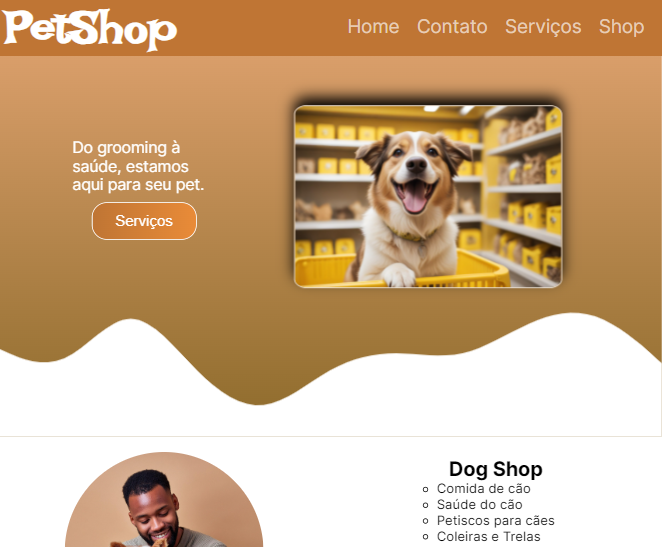

<h1>Site - Landing page - Petshop</h1>

## :pushpin: Descrição do projeto.

- O site aborda serviços prestados po um petshop(fictício).

- ## 🛠️ Funcionalidades do projeto.
- Site com rolagem automática até áreas de interesse
- Apresentação do conteúdo de forma simples e dinâmica
## 📁 Acessando o projeto
Você pode acessar o projeto pelo [link hospedado no guithub](https://lucaspaulo001.github.io/PetShop-landing-page/)

## ✔️ Tecnologias utilizadas

- ``HTML5``
- ``CSS3``
- ``JavaScript``
